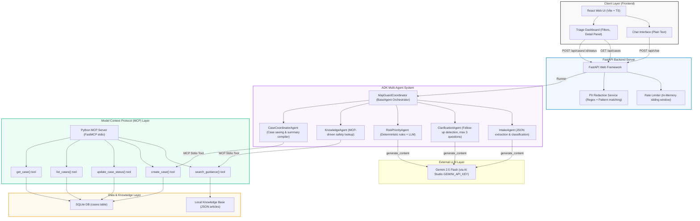

# MajiGuard Architecture

This document describes the structural and multi-agent design of **MajiGuard**, an AI water-access triage MVP built for the Kaggle Capstone Project.

## System Overview

MajiGuard consists of a React frontend and a FastAPI backend that hosts a Google ADK-powered multi-agent system. Case management and water-support knowledge lookups are handled through a local **Model Context Protocol (MCP)** server, which coordinates database access and semantic articles.

## Component Architecture

Below is the Mermaid sequence and structure diagram of MajiGuard:

## Detailed Agent Workflow

1. **Intake & Redaction**: The user report is sent to the `MajiGuardCoordinator`. PII (emails, phone numbers) is instantly redacted via Python services. The `IntakeAgent` extracts location, affected group, alternative water sources, and classifies the issue.
2. **Missing Information Check**: The `ClarificationAgent` checks if critical variables (such as location/landmark, issue duration, or affected numbers) are missing. If so, and we have asked fewer than three questions, the coordinator pauses the flow and prompts the user.
3. **Priority Triage**: Once complete, the `RiskPriorityAgent` determines case severity (Low, Medium, High, Critical) combining safety rules with Gemini's reasoning.
4. **Knowledge Retrieval**: The `KnowledgeAgent` uses the `search_guidance` MCP tool to search for matching community safety articles.
5. **Incident Finalization**: The `CaseCoordinatorAgent` compiles all details, calls the `create_case` MCP tool to save the case to the SQLite database, and returns the case summary and ID to the user.
